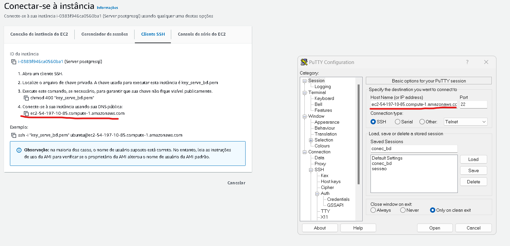
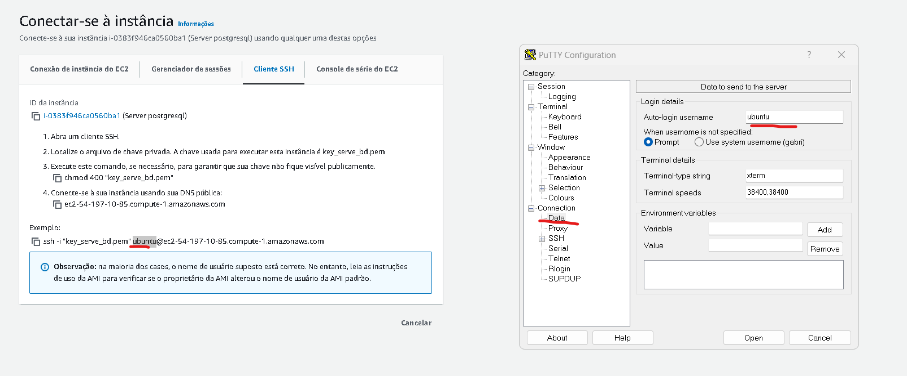
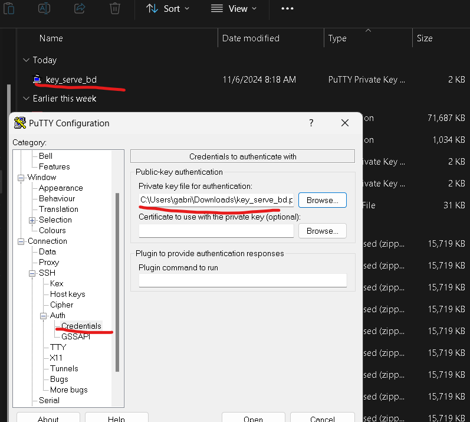
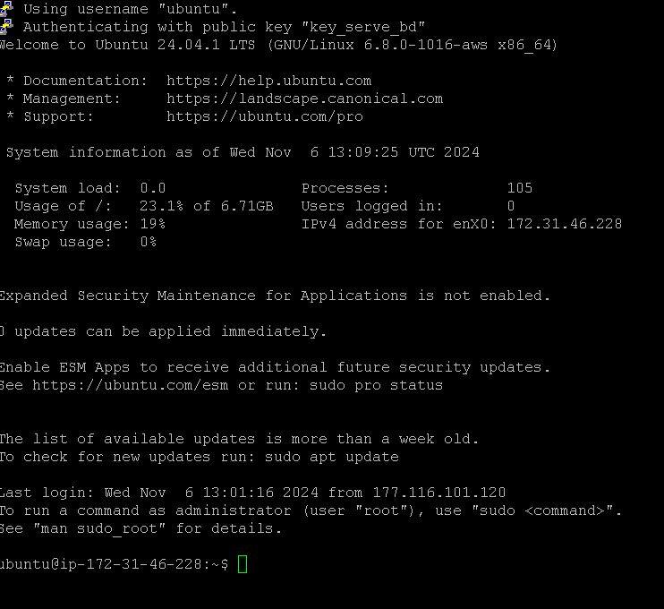
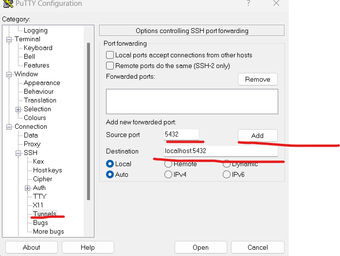
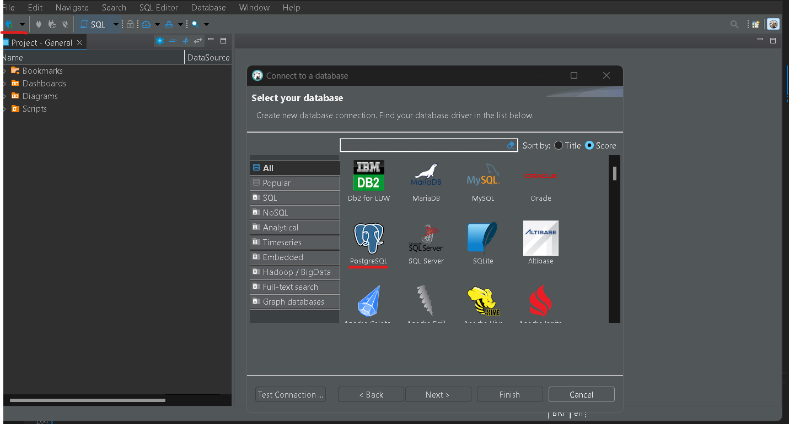
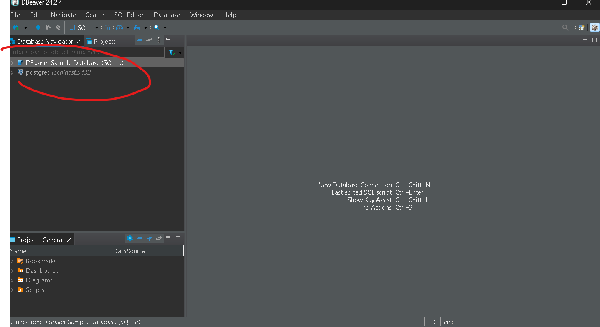
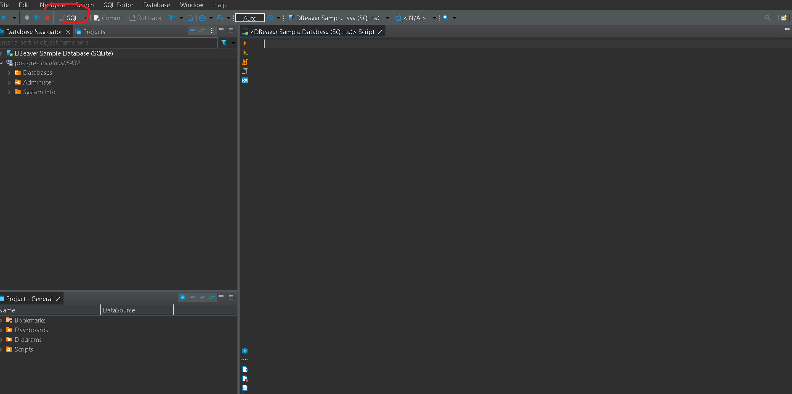
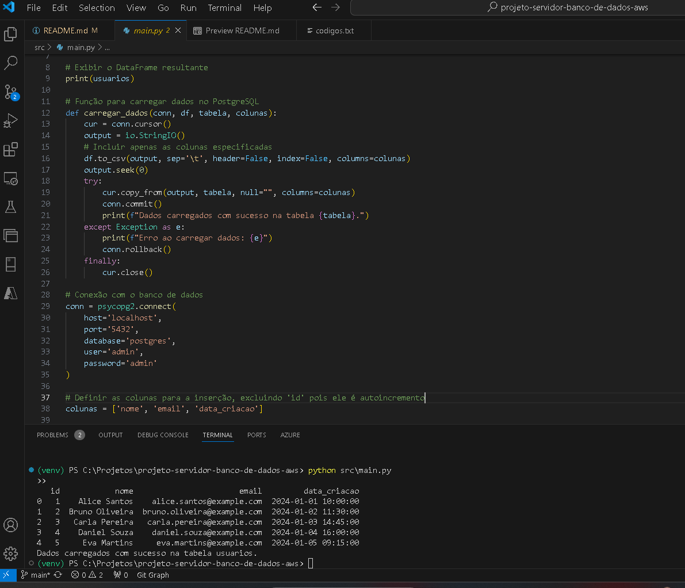
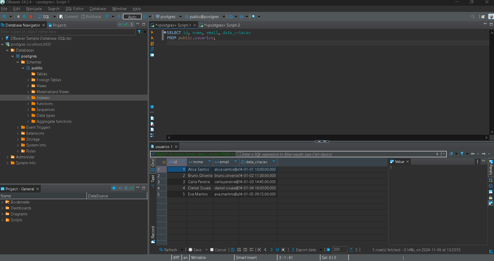

# Projeto: Servidor de Banco de Dados na AWS

## Descrição
Este projeto tem como objetivo hospedar um banco de dados PostgreSQL na nuvem AWS, utilizando instâncias EC2 para provisionamento do servidor. Ferramentas adicionais como PuTTY, DBeaver e Python são empregadas para acesso e gerenciamento do banco de dados.

## Ferramentas Utilizadas
- **AWS EC2:** Instâncias na nuvem para hospedar o banco de dados.
- **PuTTY:** Cliente SSH para acesso remoto seguro ao servidor.
- **DBeaver:** Ferramenta GUI para administração e interação com o banco PostgreSQL.
- **Python:** Scripts para enviar os dados de um arquivo csv local para o banco.

## Como Configurar
1. **Provisionar Instância EC2:**
   - Acesse o AWS Management Console.

   

   - Pesquiser por EC2.

   

   - Após isso clique em instâncias.

   

   - Crie uma nova instância EC2 clicando em executar.

   

   - De um nome a sua instância

   

   - Você precisa selecionar um sistema operacional para a instância. Neste caso, escolherei o Ubuntu, pois é gratuito e fácil de configurar. Após essa etapa, é necessário definir o tipo de instância; optarei pela t2.micro, que é gratuita e ideal para testes iniciais.

   

   

   - Em seguida, crie um par de chaves para login, atribuindo um nome a elas. As chaves devem ser geradas no formato PPK, pois utilizaremos o PuTTY para este projeto. Ao finalizar a criação, as chaves serão baixadas para o seu computador; mantenha-as seguras, pois serão necessárias mais tarde.

   

   

   - Um ponto importante a mencionar são os grupos de segurança. Como este projeto é apenas para fins de aprendizado, configuraremos o grupo para permitir o tráfego SSH de qualquer IP. 

   

   - Agora clique em executar a instância

   

2. **Conectar-se à Instância via PuTTY:**
   - Agora iremos conectar ao Putty, primeiramente em instâncias precisamos pegar algumas informações, clicando no ID da instância onde você consegue ter acesso as informações:

   

   - Clique em conectar, e vá ate a parte de cliente SSH.

   

   

   - Agora para podermos configurar o putty iremos pegar algumas informações como o servidor de dns público , o usuario que é ubunto e a chave de acesso que foi baixada no seu computador durante este processo também será necessária.

   

   

   

   
   - Após este processo iremos iniciar a conexão que ira abrir um prompt como este .

   

   - Após rodar estes codigos no prompt iremos criar um tunnel de SSH e nosso banco não ficar exposto na internet 

   - Você ira adicionar está etapa a conexão que ja tinha feito antes com o tunnel criado iremos para o dbeaver

   

   - com o dbeaver aberto iremos adicionar o banco de dados aos acessos dele 

   

   - Após a conexão ele vai estar assim : 

   

   - nesta parte iremos criar um script sql para criamos as tabelas 

   

   

   - agora iremos rodar nosso script para inserir os dados do nosso arquivo csv no banco de dados 

   

   - por fim iremos fazer uma verificação para ver se os dados foram realmente inseridos : 

   

