# Projeto: Servidor de Banco de Dados na AWS

## Descrição
Este projeto tem como objetivo hospedar um banco de dados PostgreSQL na nuvem AWS, utilizando instâncias EC2 para provisionamento do servidor. Ferramentas adicionais como PuTTY e DBeaver são empregadas para acesso e gerenciamento do banco de dados.

## Ferramentas Utilizadas
- **AWS EC2:** Instâncias na nuvem para hospedar o banco de dados.
- **PuTTY:** Cliente SSH para acesso remoto seguro ao servidor.
- **DBeaver:** Ferramenta GUI para administração e interação com o banco PostgreSQL.

## Como Configurar
1. **Provisionar Instância EC2:**
   - Acesse o AWS Management Console.

   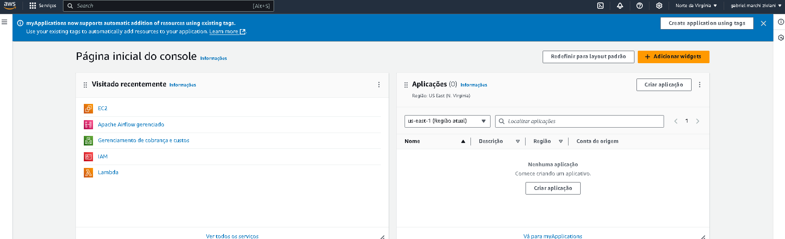


   - Pesquiser por EC2.

   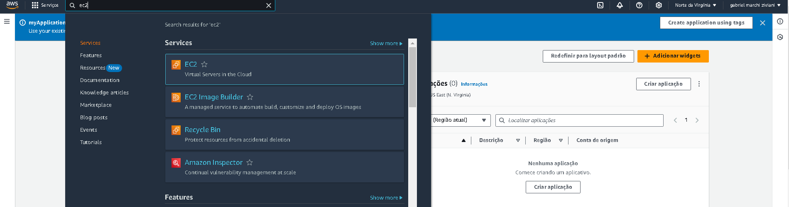


   - Após isso clique em instâncias.

   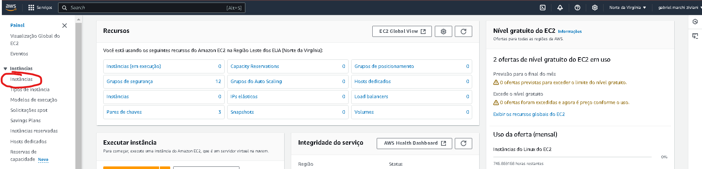


   - Crie uma nova instância EC2 clicando em executar.

   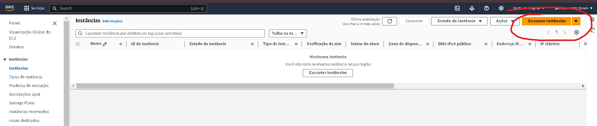


   - De um nome a sua instância

   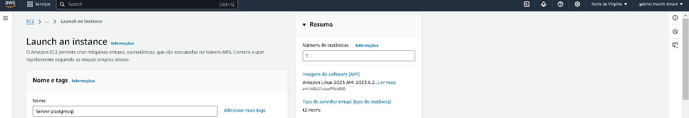

   - Você deve escolher um sistema operacional para a instância no caso irei escolher o ubunto porque e além disso escolher um tipo de instância no caso irei escolher a t2.micro que é gratuita

   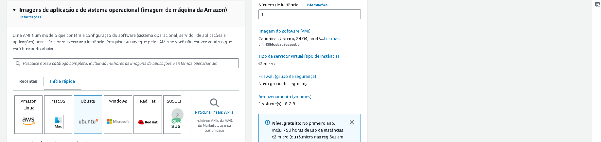


   


   - Após isso você deve criar uma par de chaves de login você deve dar um nome para elas , além disso devem ser criadas no tipo ppk pois iremos utilizar o putty para nos ajudar com este projeto, ao criar um par de chaves elas serão baixadas no seu computador guarde elas pois serão usadas mais tarde neste projeto

   

   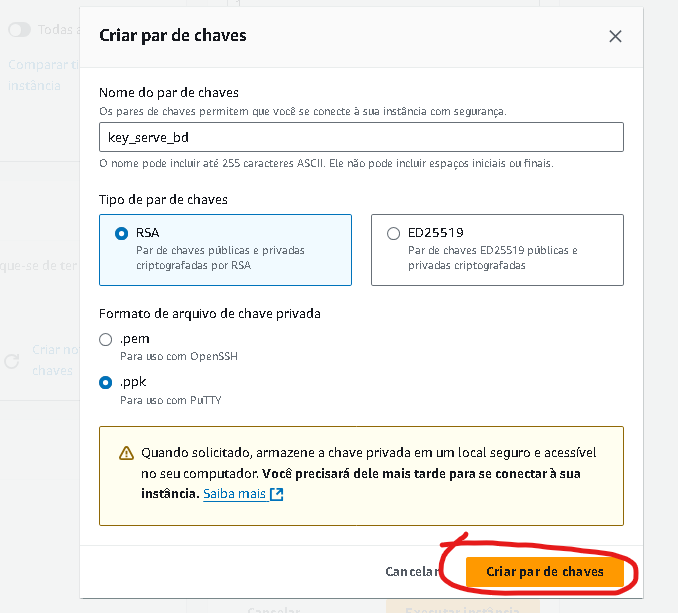


   - Um detalhe importante que preciso comentar são sobre os grupos de segurança onde por este projeto ser para fins de aprendizado iremos setar para permitir o tráfego SSH em qualquer lugar 

   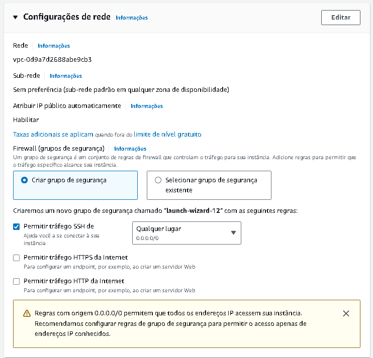


   - Agora clique em executar a instância

   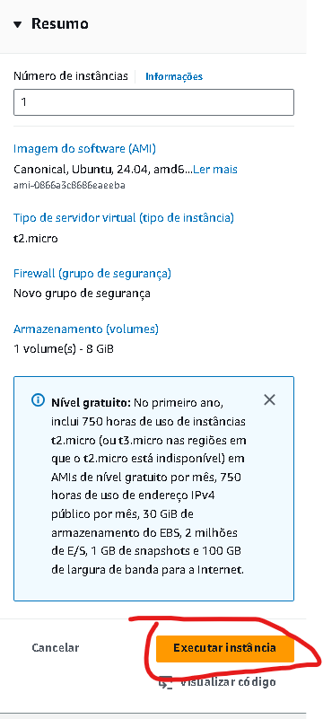


2. **Conectar-se à Instância via PuTTY:**
   - Agora iremos conectar ao Putty, primeiramente em instâncias precisamos pegar algumas informações, clicando no ID da instância você consegue ver as informações:

   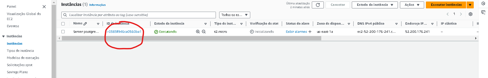


   - Clique em conectar, e vá ate a parte de cliente SSH.

   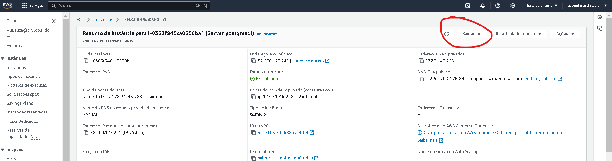

   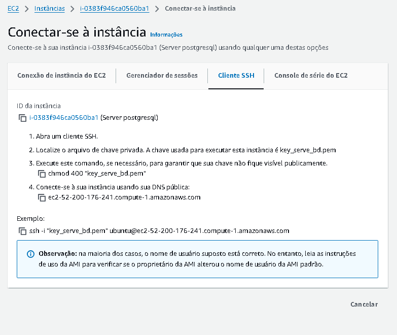


   - Configure PuTTY para conectar à instância EC2 utilizando o arquivo PPK.

   
   - Acesse a instância via SSH.

3. **Instalar PostgreSQL no Servidor:**
   - Atualize os pacotes do sistema:
     ```bash
     sudo apt update && sudo apt upgrade
     ```
   - Instale o PostgreSQL:
     ```bash
     sudo apt install postgresql postgresql-contrib
     ```

4. **Configurar o PostgreSQL:**
   - Inicie o serviço PostgreSQL:
     ```bash
     sudo systemctl start postgresql
     ```
   - Configure o PostgreSQL para aceitar conexões remotas, se necessário.

5. **Conectar ao Banco de Dados via DBeaver:**
   - Instale e configure o DBeaver.
   - Adicione uma nova conexão PostgreSQL usando o endereço público da instância EC2 e as credenciais configuradas.

## Considerações
- Certifique-se de proteger o servidor configurando corretamente as regras de firewall e utilizando autenticação segura.
- Use snapshots da instância para backup do banco de dados.

## Licença
Este projeto está licenciado sob a [MIT License](LICENSE).
